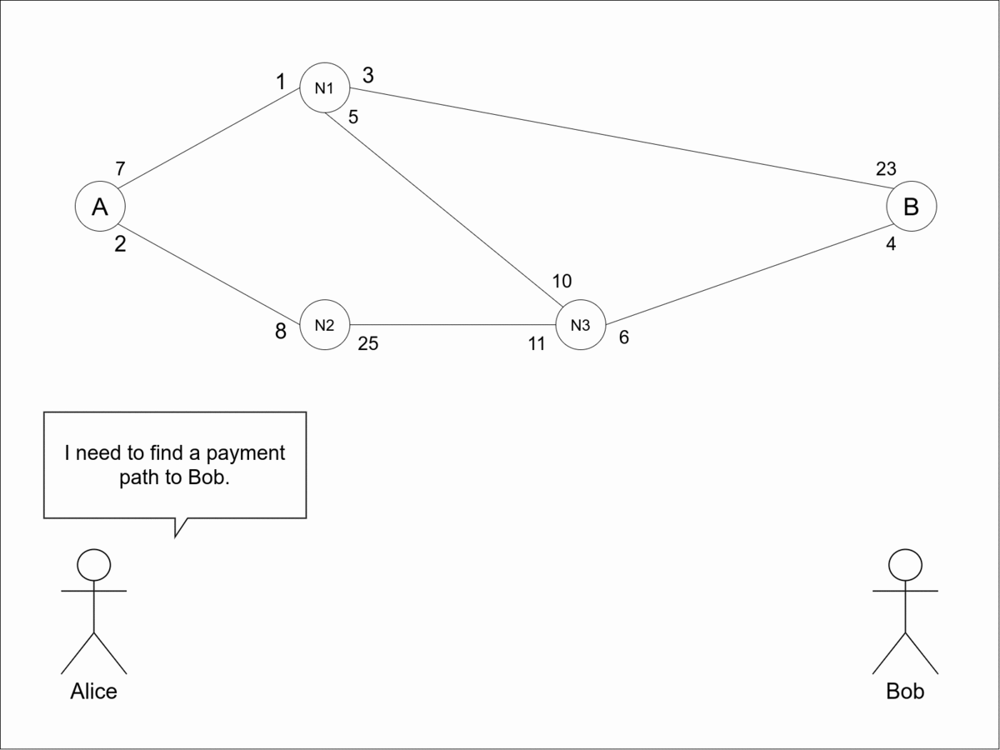

# ldRouting

ldRouting is the reference implementation of lightning distributed routing. The software is written in [golang](https://golang.org/) and in it's current state, is capable of:

- [x] Find Routes between two public lighting nodes
- [x] Register new LDR addresses
- [x] Share routing tables between peer nodes
- [ ] Find Routes to and/or from private lighting nodes
- [ ] Group routing addresses and use prefixing to work with zones
- [ ] Virtual Private Payment Networks (VPPN), the VPN equivalent of LDR

The following animation illustrates how a route is computed using the LDR protocol.



When Alice wants to find a path to Bob she sends a routing probe through the network. With the help of the routing tables kept locally by the nodes the probe collects the correct path and its associated data. When the probe reaches the destination (Bob), it returns to the sender with the routing information.

## Installation

The following instalation instructions are for running ldRouting using bitcoin's testnet.

In order to build ldRouting you'll need to download [Go](https://golang.org/dl/). The minimum supported version is Go 1.14. We recommend using the latest version of Go, which at the time of writing is [`1.14`](https://blog.golang.org/go1.14).
To build ldRouting run the following commands:

```
git clone https://github.com/jsmvalente/ldRouting
cd ldRouting
go install
```

ldRouting depends on [bitcoind](https://github.com/bitcoin/bitcoin) and [lnd](https://github.com/lightningnetwork/lnd) as backend implementations of the bitcoin and lightning protocols.

The following is an example of a ```bitcoin.conf``` file that can be used to setup bitcoind for ldRouting.

```
listen=1
testnet=1
txindex=1
server=1
zmqpubrawblock=tcp://127.0.0.1:28332
zmqpubrawtx=tcp://127.0.0.1:28333
rpcuser=MY_RPC_USER
rpcpassword=MY_RPC_PASS

[test]
rpcbind=127.0.0.1
rpcallowip=127.0.0.1
deprecatedrpc=signrawtransaction
```

lnd can also be configured by using the following ```lnd.conf``` file.

```
[Application Options]
tlsextraip=MY_IP_ADDRESS
tlsextradomain=MY_DOMAIN

[Bitcoin]
bitcoin.active=true
bitcoin.testnet=true
bitcoin.node=bitcoind

[Bitcoind]
bitcoind.rpcuser=MY_RPC_USER
bitcoind.rpcpass=MY_RPC_PASS
bitcoind.zmqpubrawblock=tcp://127.0.0.1:28332
bitcoind.zmqpubrawtx=tcp://127.0.0.1:28333
```

In order to allow peer discovery the LDR protocol uses the IP addresses announced by the lightning network nodes, so to be able to route payments to your node you should need to set ```tlsextraip``` or ```tlsextradomain``` correctly.
After setting one of those configuration options you'll need to restart lnd to regenerate your ```tls.cert```.


## Usage

To call ldRouting from anywhere you'll need to add its location to your ```$PATH``` enviroment variable:

```
export PATH=$PATH:$GOPATH/bin
```
 
Then you'll be able to start ldRouting using:

```
ldRouting -<option>=<VALUE>
```

The available options are:

```
bitcoinRPCUser=<Bitcoin core RPC user> (required)
bitcoinRPCPassword=<Bitcoin core RPC password> (required)
bitcoinClientHost=<Bitcoin core host address> (default: localhost)
bitcoinClientPort=<Bitcoin core host port> (default: 18332)
lightningClientHost=<LND host address> (default: localhost)
lightningClientPort=<LND host port> (default: 10009)
macaroonPath=<Path to the macaroon used with LND for authenticate> (default: $HOME/.lnd/data/chain/bitcoin/mainnet/admin.macaroon)
tlsCertPath=<Path to the TLS certificate used with LND for authentication> (default: $HOME/.lnd/tls.cert)
port=<Port to listen for new connections to the routing client> (default: 8695)
dataPath=<Path to directory holding the application's data> (default: $HOME/.ldRouting/data")
```

So normally you could start ldRouting by doing:

```
./ldRouting -bitcoinRPCUser=MY_RPC_USER -bitcoinRPCPassword=MY_RPC_PASS
```

**Note**: This software is still highly unstable and not ready for production.

## Contributing
Pull requests are welcome. For major changes, please open an issue or a draft PR first to discuss what you would like to change.

Please make sure to update tests as appropriate.

## Let's talk!

I'm always one DM away <a href="https://twitter.com/piggydeveloper" target="_blank">`@piggydeveloper`</a>.

If twitter is not your thing drop me an e-mail [here](mailto:joaosvalente@tecnico.ulisboa.pt?subject=[GitHub]%20Lightning%Distributed%20Routing).

## License
This software is released under the terms of the MIT license. For more see https://opensource.org/licenses/MIT.
